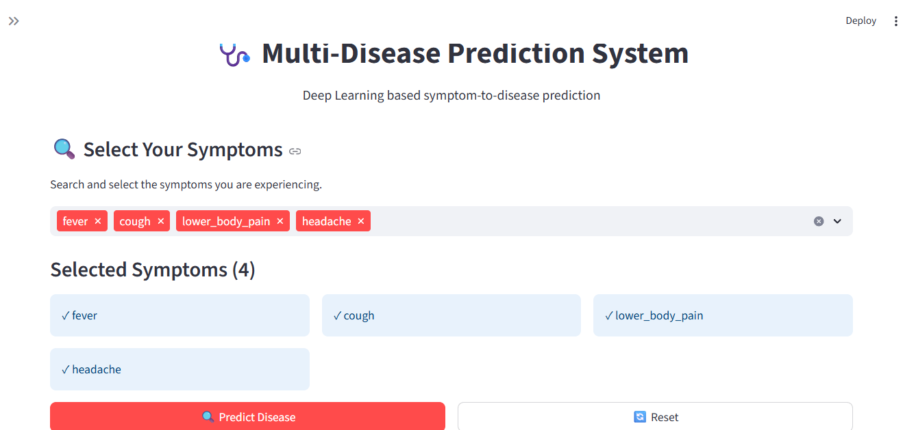
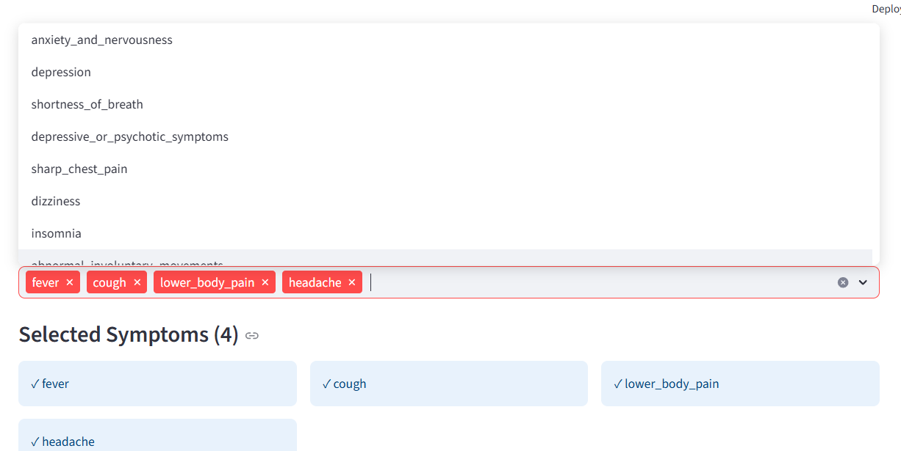
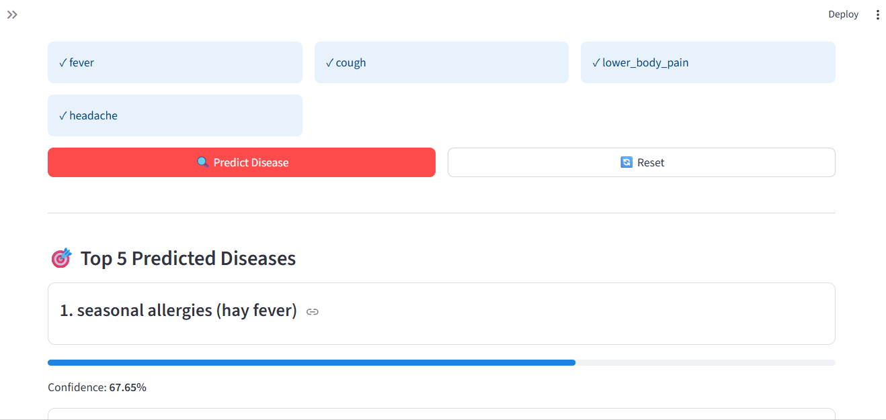
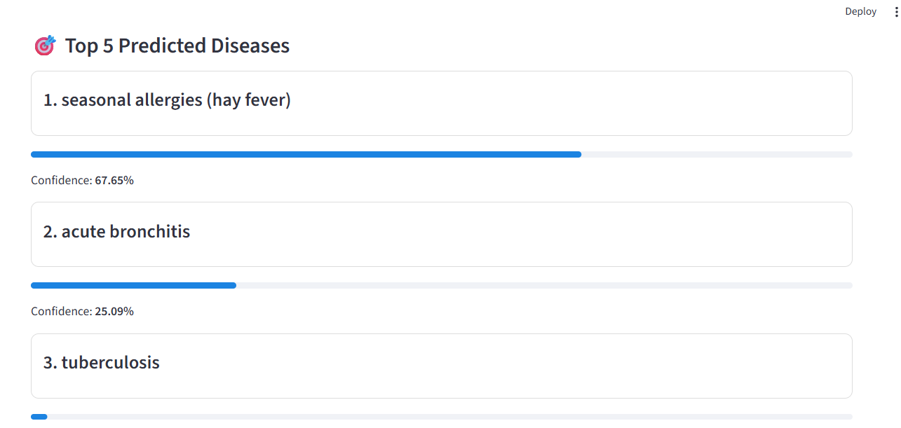
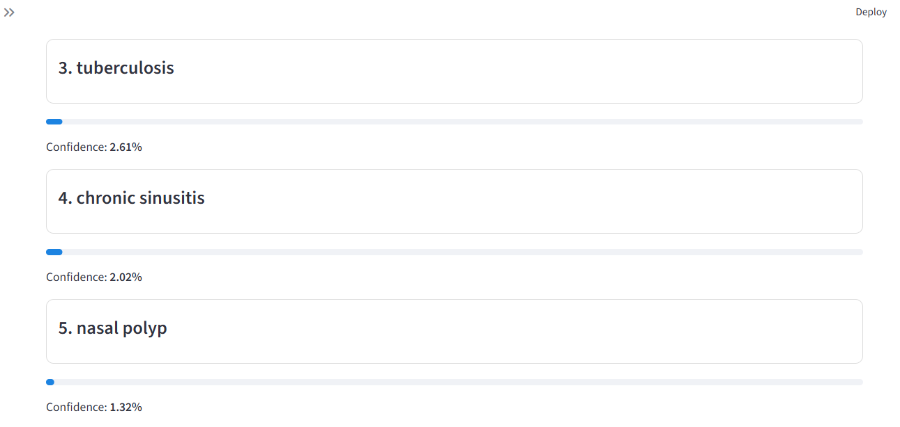

#  DeepDiseases: Multi-Disease Prediction System

### End-to-End Deep Learning Application Using Artificial Neural Network

> A symptom-based multi-disease prediction system built with an Artificial Neural Network (ANN), FastAPI, and Streamlit.

---

##  1. Project Overview

**DeepDiseases** is an end-to-end Deep Learning application that predicts possible diseases based on symptoms selected by the user.

The system uses an **Artificial Neural Network (ANN)** trained on a disease-symptom dataset to perform multi-class classification.

Users can search for and select symptoms through an interactive **Streamlit frontend**. The selected symptoms are sent to a **FastAPI backend**, where they are converted into the required numerical feature representation and passed to the trained ANN model.

The model generates probability scores for the available disease classes. The application then returns the **Top 5 predicted diseases**, including their probability and percentage values.

The project demonstrates a complete machine learning/deep learning workflow:

```text
Data
  ↓
Data Preprocessing
  ↓
Feature Preparation
  ↓
ANN Model Training
  ↓
Model Evaluation
  ↓
Model Serialization
  ↓
FastAPI Backend
  ↓
Streamlit Frontend
  ↓
Disease Prediction
```

> **Medical Disclaimer:** This project is developed for academic, educational, and research purposes. The predictions generated by the system should not be considered a medical diagnosis or a substitute for professional medical advice.

---

# 2. Project Information

| Item                        | Details                                       |
| --------------------------- | --------------------------------------------- |
| **Project Name**            | DeepDiseases: Multi-Disease Prediction System |
| **Project Type**            | End-to-End Deep Learning Application          |
| **Problem Type**            | Multi-Class Classification                    |
| **Model**                   | Artificial Neural Network (ANN)               |
| **Disease Classes**         | 659                                           |
| **Prediction Output**       | Top 5 Diseases                                |
| **Backend**                 | FastAPI                                       |
| **Frontend**                | Streamlit                                     |
| **Deep Learning Framework** | TensorFlow / Keras                            |
| **Student**                 | Niraj Kumar Chaudhary                         |
| **Instructor**              | Nabin Katwal                                  |
| **Institute**               | Vrit Jobs                                     |
| **Submission Date**         | September 2026                                |

---

# 3. Problem Statement

Identifying diseases from symptoms can be challenging because different diseases may share similar symptoms.

The objective of DeepDiseases is to develop an AI-based system that can analyze user-selected symptoms and identify diseases based on patterns learned from a disease-symptom dataset.

The trained Artificial Neural Network produces probability scores for the available disease categories. The application then presents the five highest-probability predictions to the user through a web-based interface.

The system is designed as an educational demonstration of how Deep Learning can be integrated into a complete software application.

---

# 4. Project Objectives

The main objectives of this project are:

* Develop a disease prediction system using an Artificial Neural Network.
* Process symptom-based healthcare data for Deep Learning.
* Perform data cleaning and preprocessing.
* Prepare symptom features for model training.
* Train an ANN for multi-class disease classification.
* Evaluate the model using multiple classification metrics.
* Save the trained model and preprocessing artifacts.
* Develop a REST API using FastAPI.
* Develop an interactive frontend using Streamlit.
* Connect the frontend with the prediction API.
* Return the top five predicted diseases with probability scores.
* Demonstrate a complete end-to-end Deep Learning workflow.

---

# 5. Dataset

## 5.1 Dataset Information

The project uses the **Disease-Symptom Dataset** obtained from Kaggle.

### Dataset Source

[Disease-Symptom Dataset — Kaggle](https://www.kaggle.com/datasets/dhivyeshrk/diseases-and-symptoms-dataset?utm_source=chatgpt.com)

| Attribute                   |                   Value |
| --------------------------- | ----------------------: |
| Dataset Name                | Disease-Symptom Dataset |
| Source                      |                  Kaggle |
| Format                      |                     CSV |
| Total Records               |                 246,945 |
| Total Columns               |                     378 |
| Input Features              |            377 symptoms |
| Target Variable             |                 Disease |
| Original Disease Categories |                     773 |
| Missing Values              |                       0 |
| Duplicate Records           |                  57,305 |
| Final Model Classes         |                     659 |

---

## 5.2 Dataset Description

The dataset contains symptom information represented as binary features.

Each symptom is represented using:

```text
1 → Symptom is present
0 → Symptom is absent
```

The original dataset contains **377 symptom features** and a target variable called `Disease`.

The original dataset contains 773 disease categories. After the project's data preparation and selection process, the final trained model contains **659 disease classes**.

This means the current application is capable of producing predictions across **659 disease categories**.

---

# 6. Data Preparation

The data preparation process was performed before training the ANN model.

The general workflow was:

Raw Dataset
     ↓
Data Loading
     ↓
Data Inspection
     ↓
Missing Value Analysis
     ↓
Duplicate Analysis
     ↓
Data Cleaning
     ↓
Disease/Class Preparation
     ↓
Feature Preparation
     ↓
Train/Test Split
     ↓
ANN Training


### Data Quality Summary

| Property                 |   Value |
| ------------------------ | ------: |
| Total Records            | 246,945 |
| Total Features           |     377 |
| Missing Values           |       0 |
| Duplicate Records        |  57,305 |
| Original Disease Classes |     773 |
| Final Model Classes      |     659 |

---

# 7. Machine Learning Approach

The project is formulated as a **multi-class classification problem**.

An **Artificial Neural Network (ANN)** is used to learn the relationship between symptom combinations and disease categories.

The trained model receives a binary symptom vector as input.

For example:

Symptom 1 → 1
Symptom 2 → 0
Symptom 3 → 1
Symptom 4 → 0
...
Symptom N → 1

The resulting feature vector is passed to the ANN.

The model generates probability values for the available disease classes.

The backend then sorts these probabilities and returns the **Top 5 predictions**.

---

# 8. Artificial Neural Network

The ANN performs multi-class disease classification.

The conceptual workflow is:


Selected Symptoms
       ↓
Binary Feature Vector
       ↓
Input Layer
       ↓
Hidden Layers
       ↓
Non-Linear Activation
       ↓
Output Layer
       ↓
Disease Probabilities
       ↓
Top 5 Predictions


The model is stored as:


models/multi_disease_ann.h5


The backend loads the trained model using TensorFlow/Keras:


model = load_model(MODEL_PATH)


# 9. Model Evaluation

The trained ANN was evaluated using weighted and macro-averaged classification metrics.

## 9.1 Weighted Metrics

| Metric        |      Score |
| ------------- | ---------: |
| **Accuracy**  | **0.8308** |
| **Precision** | **0.8605** |
| **Recall**    | **0.8308** |
| **F1 Score**  | **0.8372** |

In percentage form:

| Metric        |     Result |
| ------------- | ---------: |
| **Accuracy**  | **83.08%** |
| **Precision** | **86.05%** |
| **Recall**    | **83.08%** |
| **F1 Score**  | **83.72%** |

The weighted metrics account for the contribution of each class according to its number of samples.


## 9.2 Macro Metrics

Macro averaging calculates the metric independently for each disease class and then takes the unweighted average across classes.

| Metric              |      Score |
| ------------------- | ---------: |
| **Macro Precision** | **0.7906** |
| **Macro Recall**    | **0.7641** |
| **Macro F1**        | **0.7581** |

In percentage form:

| Metric              |     Result |
| ------------------- | ---------: |
| **Macro Precision** | **79.06%** |
| **Macro Recall**    | **76.41%** |
| **Macro F1**        | **75.81%** |

### Evaluation Summary


Accuracy          : 83.08%
Weighted Precision: 86.05%
Weighted Recall   : 83.08%
Weighted F1       : 83.72%

Macro Precision   : 79.06%
Macro Recall      : 76.41%
Macro F1          : 75.81%


The difference between the weighted and macro metrics indicates that model performance varies across disease classes, which is important to consider in a multi-class problem with many disease categories.


# 10. Saved Model Artifacts

The application uses three saved artifacts.

models/
│
├── multi_disease_ann.h5
├── disease_label_encoder.pkl
└── disease_feature_names.pkl


### 10.1 ANN Model


multi_disease_ann.h5


Contains the trained Artificial Neural Network.


### 10.2 Disease Label Encoder


disease_label_encoder.pkl


The label encoder maps the numerical model output back to the original disease names.

The backend loads it using:


label_encoder = joblib.load(
    LABEL_ENCODER_PATH
)


### 10.3 Feature Names


disease_feature_names.pkl


Contains the feature names used during model training.

The backend uses these feature names to construct the input vector from the symptoms selected by the user.


# 11. System Architecture

The application follows a frontend-backend-model architecture.


                         USER
                           │
                           ▼
              ┌────────────────────────┐
              │   STREAMLIT FRONTEND   │
              │                        │
              │  Search & Select       │
              │  Symptoms              │
              └────────────┬───────────┘
                           │
                           │ HTTP Request
                           ▼
              ┌────────────────────────┐
              │     FASTAPI BACKEND    │
              │                        │
              │  Request Validation    │
              │  Prediction Endpoint   │
              └────────────┬───────────┘
                           │
                           ▼
              ┌────────────────────────┐
              │     PREPROCESSING      │
              │                        │
              │ Symptom → Feature      │
              │ Vector                 │
              └────────────┬───────────┘
                           │
                           ▼
              ┌────────────────────────┐
              │       ANN MODEL        │
              │                        │
              │  Disease Probability   │
              │  Prediction            │
              └────────────┬───────────┘
                           │
                           ▼
              ┌────────────────────────┐
              │      TOP 5 RESULTS     │
              │                        │
              │ Disease + Probability  │
              └────────────┬───────────┘
                           │
                           ▼
              ┌────────────────────────┐
              │   STREAMLIT RESULTS    │
              └────────────────────────┘


# 12. FastAPI Backend

The backend is implemented using **FastAPI**.

The API is responsible for:

* Loading the ANN model.
* Loading the disease label encoder.
* Loading the feature names.
* Validating symptoms.
* Creating the model input vector.
* Generating predictions.
* Sorting disease probabilities.
* Returning the top five predictions.


## 12.1 API Base URL

During local development:


http://127.0.0.1:8000


## 12.2 Root Endpoint

### Request


GET /


### Response


{
    "success": true,
    "message": "Multi-Disease Prediction API is running"
}


## 12.3 Get Available Symptoms

### Request


GET /symptoms


This endpoint returns the available symptom features used by the model.

### Example Response


{
    "success": true,
    "count": 377,
    "symptoms": [
        "symptom_1",
        "symptom_2",
        "symptom_3"
    ]
}


The exact number returned by the API corresponds to the saved feature list used by the trained model.


## 12.4 Disease Prediction

### Request


POST /predict


### Request Body


{
    "symptoms": [
        "symptom_1",
        "symptom_2",
        "symptom_3"
    ]
}


### Response Structure


{
    "success": true,
    "selected_symptoms": [
        "symptom_1",
        "symptom_2",
        "symptom_3"
    ],
    "predictions": [
        {
            "disease": "Disease A",
            "probability": 0.68,
            "percentage": 68.0
        },
        {
            "disease": "Disease B",
            "probability": 0.12,
            "percentage": 12.0
        }
    ]
}


The API returns the **Top 5 predictions** sorted by probability.


# 13. Prediction Process

When the user selects symptoms, the backend creates an empty feature vector:


input_data = np.zeros(
    len(feature_names),
    dtype=np.float32
)


The selected symptoms are then converted to binary features:


Selected symptom → 1
Non-selected symptom → 0


The resulting vector is reshaped and passed to the ANN:


input_data = input_data.reshape(1, -1)

probabilities = model.predict(
    input_data,
    verbose=0
)[0]


The backend then identifies the five highest probability values:


top_indices = np.argsort(
    probabilities
)[-5:][::-1]


Finally, the numerical predictions are converted back into disease names using the saved label encoder.


# 14. Streamlit Frontend

The frontend is developed using **Streamlit**.

The interface provides:

* Disease prediction interface
* Symptom search
* Symptom selection
* Selected symptom display
* Top 5 prediction results
* Probability visualization
* Backend connection status
* Reset functionality
* Medical disclaimer

### Frontend URL


http://localhost:8501


# 15. Application Workflow

The user workflow is:


1. Open the Streamlit application
        ↓
2. Search available symptoms
        ↓
3. Select one or more symptoms
        ↓
4. Click "Predict Disease"
        ↓
5. Streamlit sends request to FastAPI
        ↓
6. FastAPI validates symptoms
        ↓
7. Symptoms are converted to feature vector
        ↓
8. ANN generates probabilities
        ↓
9. Backend selects Top 5 predictions
        ↓
10. Results are returned to Streamlit
        ↓
11. Predictions and confidence percentages are displayed


# 16. Project Structure


DeepDiseases/
│
├── data/
│   ├── raw/
│   │   └── disease_symptom_dataset.csv
│   │
│   └── processed/
│
├── notebooks/
│   ├── 01_data_collection.ipynb
│   ├── 02_data_preprocessing.ipynb
│   ├── 03_eda.ipynb
│   └── 04_ann_model.ipynb
│
├── models/
│   ├── multi_disease_ann.h5
│   ├── disease_label_encoder.pkl
│   └── disease_feature_names.pkl
│
├── backend/
│   ├── __init__.py
│   └── main.py
│
├── frontend/
│   └── app.py
│
├── screenshots/
│   ├── home.png
│   ├── symptom_selection.png
│   └── prediction_result.png
│
├── requirements.txt
├── .gitignore
└── README.md


# 🛠️ 17. Technology Stack

| Category                    | Technology                 |
| --------------------------- | -------------------------- |
| Programming Language        | Python                     |
| Deep Learning               | TensorFlow / Keras         |
| Data Processing             | Pandas, NumPy              |
| Machine Learning            | Scikit-learn               |
| Visualization               | Matplotlib, Seaborn        |
| Backend Framework           | FastAPI                    |
| API Server                  | Uvicorn                    |
| Frontend Framework          | Streamlit                  |
| Model Serialization         | H5                         |
| Preprocessing Serialization | Joblib                     |
| Development Environment     | Jupyter Notebook / VS Code |
| Version Control             | Git / GitHub               |


# ⚙️ 18. Installation

## Prerequisites

Make sure the following are installed:

* Python
* Anaconda 
* Git


## Clone the Repository


git clone https://github.com/YOUR_USERNAME/DeepDiseases.git


Navigate to the project directory:


cd DeepDiseases


## Create Environment


conda create -n deepdiseases python=3.13

Activate the environment:


conda activate deepdiseases


## Install Dependencies


pip install -r requirements.txt


# 🚀 19. Running the Backend

Start the FastAPI server from the project root:


uvicorn backend.main:app --reload


The API will run at:


http://127.0.0.1:8000


### Swagger API Documentation

Open:


http://127.0.0.1:8000/docs


FastAPI's Swagger interface can be used to test the API endpoints interactively.


# 20. Running the Frontend

Open another terminal and activate the environment:


conda activate deepdiseases


Run:


streamlit run frontend/app.py


The Streamlit application will open at:


http://localhost:8501


Make sure the FastAPI backend is running before using the prediction functionality.


# 21. Application Screenshots

## Home Page



## Symptom Selection




## Prediction Results




The application displays the five highest-probability disease predictions along with their corresponding confidence percentages.

---

# 22. Limitations

## Dataset Limitations

* The dataset is artificially generated and may not fully represent real-world clinical data.
* The dataset contains class imbalance, with 713 disease classes and 154 classes having only one sample.
* Single-sample classes caused difficulties when using stratify=y during train-test splitting.
* Duplicate records were identified during data analysis.
* Some diseases have similar or overlapping symptoms.

## Model Limitations

* Model performance depends on the quality and distribution of the training data.
* Rare disease classes may not be learned reliably due to insufficient samples.
* The model uses symptoms only and does not consider medical history, laboratory tests, imaging, or     physical examination.
* Performance may vary across different disease classes.

## Application Limitations

* The final model contains 659 disease classes.
* The application displays only the Top 5 predictions.
* Model-generated probabilities should not be considered medical certainty.
* The system is intended for educational and research purposes, not professional medical diagnosis.

# 23. Future Improvements

Future versions of DeepDiseases could include:

### Model Improvements

* Use larger and clinically validated datasets.
* Improve class balance across disease categories.
* Perform systematic hyperparameter optimization.
* Experiment with different neural network architectures.
* Compare ANN with other machine learning and Deep Learning approaches.
* Apply regularization and advanced optimization techniques where appropriate.

### Explainable AI

* Integrate SHAP or LIME.
* Identify symptoms contributing most to predictions.
* Provide more interpretable prediction explanations.

### Application Improvements

* Add user authentication.
* Store prediction history.
* Integrate a database.
* Improve UI/UX design.
* Add multilingual support.
* Add cloud deployment.
* Develop a mobile application.
* Add model monitoring and retraining capabilities.


# 24. Medical Disclaimer

> **DeepDiseases is an academic and educational project and is not a medical diagnostic system.**

The predictions generated by this application are based on patterns learned from the training dataset.

They should not be interpreted as:

* A professional medical diagnosis
* Medical advice
* A treatment recommendation
* A substitute for consultation with a qualified healthcare professional

Anyone experiencing health concerns should seek advice from an appropriately qualified healthcare professional.


# 25. Author

## Niraj Kumar Chaudhary

**Project:** DeepDiseases: Multi-Disease Prediction System
**Institute:** Vrit Jobs
**Instructor:** Nabin Katwal

### GitHub


https://github.com/Niraj7272/Multi-Diseases_prediction_DL


### LinkedIn


https://www.linkedin.com/feed/


# 26. Key Features

* Artificial Neural Network
* Multi-Disease Prediction
* Symptom-Based Classification
* 659 Disease Classes
* Top 5 Predictions
* Probability-Based Results
* Data Preprocessing
* FastAPI REST API
* Streamlit Web Interface
* End-to-End Deep Learning Workflow
* Saved Model and Preprocessing Artifacts
* Interactive API Documentation


# 27. License

This project is developed for academic and educational purposes.

The third-party dataset is subject to the terms and conditions specified by its original publisher on Kaggle.
